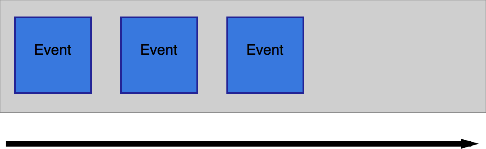
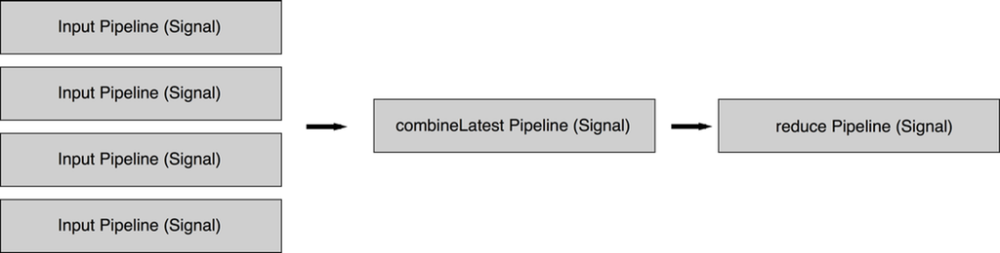

# Everyday ReactiveCocoa

## Rob Pearson @robpearson

---

# Maple Pixel.  

## Everyday Transit coming soon.

^ Add Image

---

# Thoughts and Experience using ReactiveCocoa Everyday for 5-6 months

^ Everyday since November

---

> FrieNDA.   

^ Unreleased App.  Code Examples.  Please be kind ... 

---

# Everyday ReactiveCocoa

1. Review __*Functional*__ Programming 
2. Introduce Functional __*Reactive*__ Programming
3. Everyday __*ReactiveCocoa*__ Code Examples

---

> Review Functional Programming

---

# Functional Programming

## In functional programming, programs are executed by evaluating expressions  ... avoids using mutable state.

##### - Haskell Wiki http://haskell.org/haskellwiki/Functional_programming

^ Declarative, Expressive, Side Effect Free.  This eliminates a whole class of bugs inherently.  

--- 

# Functional Building Blocks

* Purity
* Higher Order Functions
* Recursion 

--- 

# Purity

## f(x) = x + 1

^ Output is calculated soley on its inputs
^ Repeatable
^ No Side Effects
^ Immutable Data

---

# Higher Order Functions

## Input or Output is a Function

^ map, reduce, filter, concat, take ...

---

# Recursion

## Not much to say about this

---

> Functional Reactive Programming

---

# Inputs and Outputs

## "Programs take input and produce output. The output is the result of doing something with the input. Input, transform, output, done."

##### Josh Abernathy - http://blog.maybeapps.com/post/42894317939/input-and-output

---

# Inputs

* Keyboard (text) input
* Click/Touch input
* Timers (intervals)
* GPS location changes
* Data from webservices
* Images from webservices

...

---

# Outputs

* UI Changes
* Sounds 
* Persist data somewhere
* Push data to the cloud

...

---

# Conventional Programming vs. Reactive Programming

## Event Handlers, Delegates, KVO vs. Descriptive Expressions to Handle Events

^ Talk about how reactive programming is declarative and expressive.  It involves writing description expressions that handle events.

--- 



^ Talk about signal "pipeline" and how events are added over time.  The program reacts to handle the new inputs/events.  

^ NOTE: Pipeline is my term.  It's pretty standard but make sure people understand it's not a RAC/Reactive thing.

---

# Reacting to Signals via subscriptions

```objectivec
[signal subscribeNext:^(id value) {
    // Event handling
} error:^(NSError *error) {
    // Error handling
} completed:^{
    // Completion handling
}];
```

^ So we have a signal, how do we react to its changes.

--- 

# Hello World

Typical example, a sign-up form:

```objectivec
RAC(self.submitButton, enabled) = [RACSignal
    combineLatest:@[
        self.firstNameField.rac_textSignal,
        self.lastNameField.rac_textSignal,
        self.emailField.rac_textSignal,
        self.reEmailField.rac_textSignal
    ]
    reduce:^(NSString *first, NSString *last, NSString *email, NSString *reEmail) {
        return @(first.length > 0 && last.length > 0 && email.length > 0 && reEmail.length > 0 && [email isEqual:reEmail]);
    }];
```

##### Josh Abernathy - http://blog.maybeapps.com/post/42894317939/input-and-output

----



---

> Boom!

---

# Why is FRP better?  

* Minimal App State 
* Declarative
* Expressive
* Different ... 

---

# ReactiveCocoa

## Reactive Functional Programming framework by Github

^ OK, let's talk about ReactiveCocoa.

---

# It's all about Signals! (RACSignal)

## Build the Pineline

---

> Everyday ReactiveCocoa Code Examples

---

# Creating Signals

```objectivec

- (RACSignal *)runReactiveDatabaseFetchBlock:(FMResultSet *(^)(FMDatabase *database))databaseFetchBlock andMapObjects:(id (^)(FMResultSet * resultSet))mapObjectBlock {

    // TODO: Rename as this isn't ideal.

    NSParameterAssert(databaseFetchBlock != nil);
    NSParameterAssert(mapObjectBlock != nil);

    RACSignal *databaseFetchSignal = [RACSignal createSignal:^RACDisposable *(id <RACSubscriber> subscriber) {

        __block FMResultSet *resultSet = nil;

        [self.databaseQueue inDatabase:^(FMDatabase *database) {

            resultSet = databaseFetchBlock(database);

            while ([resultSet next]) {
                id object = mapObjectBlock(resultSet);
                if (object != nil) {
                    [subscriber sendNext:object];
                }
            }

        }];

        [subscriber sendCompleted];

        return [RACDisposable disposableWithBlock:^{

            if (resultSet != nil){
                [resultSet close];
            }

        }];

    }];

    return databaseFetchSignal;
}

```

---

# Key Value Observing

```objectivec

// Bind Everyday Transit Trips to Table View
[RACObserve(self.viewModel, everydayTransitTrips) subscribeNext:^(id x) {
    @strongify(self);

    // Refresh 'Everyday Transit Trips' MCSimpleTableSection if needed
    ... 

    [self.tableView reloadData];
}];

```

---

# RAC macro for binding a signal to a property


---

# RAC for handling selectors etc

```

    [[self rac_signalForSelector:@selector(searchBar:textDidChange:) fromProtocol:@protocol(UISearchBarDelegate)] subscribeNext:^(RACTuple *value) {
        @strongify(self);

        UISearchBar *searchBar = value.first;

        if (searchBar == self.departingLocationsSearchBar) {
            [self.viewModel filterDepartingLocationsByName:self.departingLocationsSearchBar.text];
        }
        else {
            [self.viewModel filterArrivingLocationsByName:self.arrivingLocationsSearchBar.text];
        }

    }]; 

```

---

# Signals for blah

```objectivec

   // Add Button
    self.addButton.rac_command = [[RACCommand alloc]
            initWithEnabled:self.viewModel.canAddNewEverydayTransitTripSignal
                signalBlock:^RACSignal *(id input) {

                    return [RACSignal createSignal:^RACDisposable *(id <RACSubscriber> subscriber) {
                        @strongify(self);

                        BOOL hasAddedNewTrip = [self.viewModel addNewEverydayTransitTrip]; // <- signal so i can manage errors

                        if (hasAddedNewTrip == YES){
                            [self performSegueWithIdentifier:@"newEverydayTripAdded" sender:self];
                        }
                        else{
                            // TODO: Add support for error handling from the command.
                        }

                        [subscriber sendCompleted];
                        return nil;
                    }];
                }];
    [self.addButton.rac_command.errors subscribeNext:^(id x) {
        // TODO: Add support for error handling from the command.
    }];


```

---

# RAC helpers for generating signals from controls

```objectivec

MCSimpleTableCell *everydayTransitTripCell = [[MCSimpleTableCell alloc] init];
            everydayTransitTripCell.cellIdentifier = @"cellwithswitch";
            everydayTransitTripCell.configureBlock = ^(MCSimpleTableCell *cell, UITableViewCell *tableCell) {

                tableCell.textLabel.text = trip.tripDescription;

                UISwitch *control = [[UISwitch alloc] initWithFrame:CGRectZero];
                control.on = trip.isEnabled;
                tableCell.accessoryView = control;

                tableCell.selectionStyle = UITableViewCellSelectionStyleNone;

                [[control rac_signalForControlEvents:UIControlEventValueChanged] subscribeNext:^(id x) {

                    @strongify(self);
                    [self.viewModel toggleTripEnablementWithEverydayTransitTripId:trip.everydayTransitTripId];

                }];

            };
            [everydayTransitTripsSection addCell:everydayTransitTripCell];

```

---

# Real Power is combing and chaining signals

# Build the Pipeline - Demo

---

### Simple Transit Dashboard

Inputs
* Transit Service Times
* Location Updates
* Time Updates

Output
* Next Transit Service based on time/location

---

# ReactiveCocoa v3 is coming soon

---

# Protips

* Start by reading IntroToRx.com
* Start small and build.
* Asks questions by opening issues at http://github.com/ReactiveCocoa/

---

# Challenges

* ReactiveCocoa Doco
* Thinking like a Functional Programmer
* Debugging
* Unit Testing

---

> Questions?

---

# References

* http://haskell.org/haskellwiki/Functional_programming
* Intro to RX : http://IntroToRx.com

---

# Reactive Cocoa References

* FRP on iOS by Ash Furrow : https://leanpub.com/iosfrp
* NSHipster on RAC : http://nshipster.com/reactivecocoa/
* Ray Wenderlich on RAC
* Big Nerd Ranch on RAC 

---
