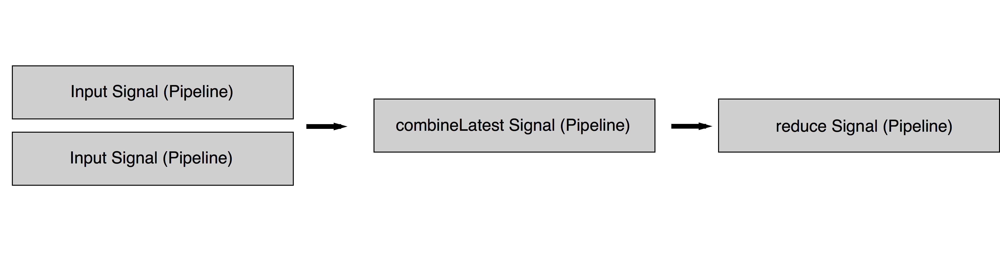

# Everyday ReactiveCocoa

## Rob Pearson @robpearson

---

# Maple Pixel

## Everyday Transit coming soon  ... hopefully

^ Add Teaser Image

---

# Thoughts and Experience using ReactiveCocoa Everyday for 5-6 months

^ Everyday since November

---

> FrieNDA.   

^ Unreleased App.  Code Examples.  Please be kind ... 

---

# Everyday ReactiveCocoa

1. Review __*Functional Programming*__
2. Introduce __*Functional Reactive Programming*__
3. Everyday __*ReactiveCocoa*__ Code Examples

---

> Review Functional Programming

---

# Functional Programming

## In functional programming, programs are executed by evaluating expressions  ... avoids using mutable state.

##### - Haskell Wiki http://haskell.org/haskellwiki/Functional_programming

^ Declarative, Expressive, Side Effect Free.  This eliminates a whole class of bugs inherently.  

--- 

# Functional Building Blocks

* Purity
* Higher Order Functions

--- 

# Purity

## f(x) = x + 1

^ Output is calculated soley on its inputs
^ Repeatable
^ No Side Effects
^ Immutable Data

---

# Higher Order Functions

## Input or Output is a Function

^ map, reduce, filter, concat, take ...

---

> Functional Reactive Programming

---

# Inputs and Outputs

## "Programs take input and produce output. The output is the result of doing something with the input. Input, transform, output, done."

##### Josh Abernathy - http://blog.maybeapps.com/post/42894317939/input-and-output

---

# Inputs

* Keyboard (text) input
* Click/Touch input
* Timers (intervals)
* GPS location changes
* Resources from web services

...

---

# Outputs

* UI Changes
* Sounds 
* Persist data somewhere
* Push data to the cloud

...

--- 


^ Talk about signal "pipeline" and how events are added over time.  The program reacts to handle the new inputs/events.  

^ NOTE: Pipeline is my term.  It's pretty standard but make sure people understand it's not a RAC/Reactive thing.

---

# Reacting to Signals via subscriptions

```objectivec

[[self.transitLocationRepository getTransitLocations]     subscribeNext:^(MPXTransitLocation *transitLocation) {

        // Do something interesting with transit location 

    }                                                             error:^(NSError *error) {

        // Error handling

    }                                                         completed:^{

        // Completion handling

    }];

```

^ So we have a signal, how do we react to its changes.

--- 

# Everyday Transit Example

```objectivec

self.canAddNewEverydayTransitTripSignal = [RACSignal 
    combineLatest:@[
        self.selectedDepartingStationSignal, 
        self.selectedArrivingStationSignal
    ] 
    reduce: ^id(MPXTransitLocation *departingTransitLocation, MPXTransitLocation *arrivingTransitLocation) {

            BOOL isValid = NO;

            if (departingTransitLocation != nil && arrivingTransitLocation != nil) {
                isValid = YES;
            }

            return @(isValid);
        }];

```

----



---

> Boom!

---

# Why is FRP better?  

* Minimal App State 
* Declarative
* Expressive
* Different

^ Different: Simpler, nicer design and it can be easier to test.  
^ Different: It does change the dev patterns as there will be big up front RAC init/bindings via viewDidLoad.  

---

# ReactiveCocoa

## Reactive Functional Programming framework by Github

^ OK, let's talk about ReactiveCocoa.

---

# It's all about Signals! (RACSignal)

## Build the Pipeline

---

> Everyday ReactiveCocoa Code Examples

---

# Creating Signals

```objectivec

- (RACSignal *)runReactiveDatabaseFetchBlock:(FMResultSet *(^)(FMDatabase *database))databaseFetchBlock andMapObjects:(id (^)(FMResultSet * resultSet))mapObjectBlock {

    // TODO: Rename as this isn't ideal.

    NSParameterAssert(databaseFetchBlock != nil);
    NSParameterAssert(mapObjectBlock != nil);

    RACSignal *databaseFetchSignal = [RACSignal createSignal:^RACDisposable *(id <RACSubscriber> subscriber) {

        __block FMResultSet *resultSet = nil;

        [self.databaseQueue inDatabase:^(FMDatabase *database) {

            resultSet = databaseFetchBlock(database);

            while ([resultSet next]) {
                id object = mapObjectBlock(resultSet);
                if (object != nil) {
                    [subscriber sendNext:object];
                }
            }

        }];

        [subscriber sendCompleted];

        return [RACDisposable disposableWithBlock:^{

            if (resultSet != nil){
                [resultSet close];
            }

        }];

    }];

    return databaseFetchSignal;
}

```

---

# Key Value Observing

```objectivec

// Bind Everyday Transit Trips to Table View
[RACObserve(self.viewModel, everydayTransitTrips) subscribeNext:^(id x) {
    @strongify(self);

    // Refresh 'Everyday Transit Trips' MCSimpleTableSection if needed
    ... 

    [self.tableView reloadData];
}];

```

---

# Bind a signal to a property

```objectivec

RACSignal *titleSignal = [RACObserve(self.viewModel, title) distinctUntilChanged];
RAC(self, title) = [titleSignal deliverOn:[RACScheduler mainThreadScheduler]];

```

---

# React to Delegates/Selectors

```

    [[self rac_signalForSelector:@selector(searchBar:textDidChange:) fromProtocol:@protocol(UISearchBarDelegate)] subscribeNext:^(RACTuple *value) {
        @strongify(self);

        UISearchBar *searchBar = value.first;

        if (searchBar == self.departingLocationsSearchBar) {
            [self.viewModel filterDepartingLocationsByName:self.departingLocationsSearchBar.text];
        }
        else {
            [self.viewModel filterArrivingLocationsByName:self.arrivingLocationsSearchBar.text];
        }

    }]; 

```

---

# React to Button Commands

```objectivec

// Add Button
self.addButton.rac_command = [[RACCommand alloc]
        initWithEnabled:self.viewModel.canAddNewEverydayTransitTripSignal
            signalBlock:^RACSignal *(id input) {

                // Add New Everyday Transit Trip

            }];
[self.addButton.rac_command.errors subscribeNext:^(id x) {
    // TODO: Add support for error handling from the command.
}];

```

---

# React to Control Events

```objectivec

MCSimpleTableCell *everydayTransitTripCell = [[MCSimpleTableCell alloc] init];
everydayTransitTripCell.cellIdentifier = @"cellwithswitch";
everydayTransitTripCell.configureBlock = ^(MCSimpleTableCell *cell, UITableViewCell *tableCell) {

    tableCell.textLabel.text = trip.tripDescription;

    UISwitch *control = [[UISwitch alloc] initWithFrame:CGRectZero];
    control.on = trip.isEnabled;
    tableCell.accessoryView = control;

    tableCell.selectionStyle = UITableViewCellSelectionStyleNone;

    [[control rac_signalForControlEvents:UIControlEventValueChanged] subscribeNext:^(id x) {

        @strongify(self);
        [self.viewModel toggleTripEnablementWithEverydayTransitTripId:trip.everydayTransitTripId];

    }];

};
[everydayTransitTripsSection addCell:everydayTransitTripCell];

```

---

# Real Power is combing and chaining signals

---

### Everyday Transit Dashboard

Inputs:
* Transit Trip Times
* Location Updates
* Time Updates

Output:
* Next Transit Service based on time/location

---

# Protips

* Start by reading IntroToRx.com
* Start small and iterate.
* Asks questions by opening issues at http://github.com/ReactiveCocoa/

---

# Challenges

* ReactiveCocoa Doco
* Thinking like a Functional Programmer
* Debugging
* Unit Testing

---

# References

* NSHipster on RAC: http://nshipster.com/reactivecocoa/
* Ray Wenderlich Tutorial: https://bit.ly/1rXA31Y
* Big Nerd Ranch Tutorial: https://bit.ly/1mp04mI
* FRP on iOS by Ash Furrow: https://leanpub.com/iosfrp
* Brent Simmons on ReactiveCocoa: https://bit.ly/PcyjCL

---

> Questions?
