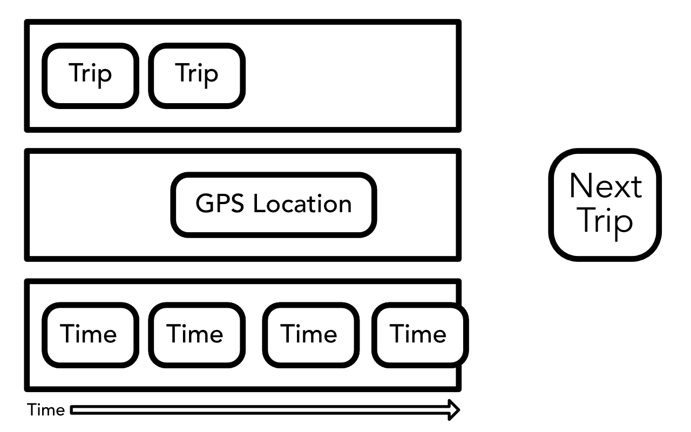

# ReactiveCocoa Lessons Learned

## Rob Pearson @robpearson

---

# Maple Pixel

## Everyday Transit 1.0
## coming soon ...


---

# FrieNDA

^ Unreleased App.  Code Examples.  Please be kind ...

---

# Everyday ReactiveCocoa

1. __*Functional Programming*__ Briefly
1. __*Signals and Pipelines*__
3. __*RAC*__ Lessons Learned

---

# Functional Programming
# Briefly

---


---


^ Purity: f(x) = x + 1
^ Output is calculated soley on its inputs
^ Repeatable
^ No Side Effects
^ Immutable Data

^ Higher Order Functions: Input or Output is a Function
^ map, reduce, filter, concat, take ...

---

# Signals and Pipelines

---



---

# Transit Dashboard Pipelines/Signals

* Input: List of Everyday Trips (Favourites)
* Input: GPS Location
* Input: Time
* Output: Next Transit Trip

^ It's all about Inputs and Outputs

---

# Pipelines ==
# RACSignals

---

# So we have Pipelines/Signals.  Now what?

---

# Code Example: Subscribing, Error Handling etc.

---

# *RAC* Lessons Learned

---

# *RAC* Lessons Learned

1. RACify your existing (obj-c) Code
2. RACSignal things

---

# KVO

^ This is worth the dependency

---

# No, Seriously ...  KVO!

^ This is worth the dependency

---

# Key Value Observing

```objectivec

// Bind Transit Trips to Table View
[RACObserve(self.viewModel, everydayTransitTrips) subscribeNext:^(id x) {
    @strongify(self);

    // Refresh 'Transit Trips' MCSimpleTableSection if needed
    ...

    [self.tableView reloadData];
}];

```

---

# Work with Protocols

---

# Code Example: Lift Selector thing.

---

# Create Signals of Events, Notifications, Reachability etc.

---

# Signal

---

# Reactive Timer #1

## Map Time

---

# Reactive Timer #2

## Empty Signal with a delay.  

---

# Use lift_sigal for consitency.

---

# Real Power is combing and chaining signals

---

### Transit App Dashboard

Inputs:
* Transit Trip Times
* Location Updates
* Time Updates

Output:
* Next Transit Service based on time/location

---

# Protips

* Start by reading IntroToRx.com
* Start small and iterate.
* Asks questions by opening issues at http://github.com/ReactiveCocoa/

---

# Challenges

* ReactiveCocoa Doco
* Thinking like a Functional Programmer
* Debugging
* Unit Testing

---

# References

* Github Repo: http://github.com/ReactiveCocoa/
* Ray Wenderlich Tutorial: https://bit.ly/1rXA31Y
* Big Nerd Ranch Tutorial: https://bit.ly/1mp04mI
* FRP on iOS by Ash Furrow: https://leanpub.com/iosfrp
* Brent Simmons on ReactiveCocoa: https://bit.ly/PcyjCL

---

> Questions?
