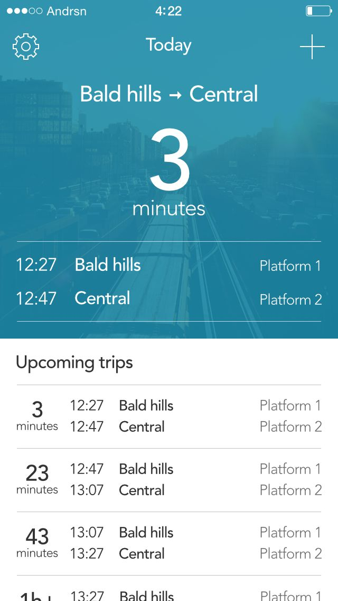

# ReactiveCocoa Lessons Learned

## Rob Pearson @robpearson

---

# Maple Pixel

## Everyday Transit 1.0
## coming soon ...

---

# FrieNDA

^ Unreleased App.  Code Examples.  Please be kind ...

---

# Everyday ReactiveCocoa

1. __*Functional Programming*__ Briefly
2. __*RACify*__ your code
3. __*RAC*__ Lessons Learned (Code Examples)

---

> Review Functional Programming

---

# Functional Programming

## Avoid State

^ Declarative, Expressive, Side Effect Free.  This eliminates a whole class of bugs inherently.  

##

---

# Functional Building Blocks

* Purity
* Higher Order Functions

---

# Purity

## f(x) = x + 1

^ Output is calculated soley on its inputs
^ Repeatable
^ No Side Effects
^ Immutable Data

---

# Higher Order Functions

## Input or Output is a Function

^ map, reduce, filter, concat, take ...

---

# Describe Reactive Cocoa Pipeline

## Event Stream

---

# So you have Signals/Event Streams.  Now what?  

## Subscribing, Error Handling etc.

---

# Things get interesting when you combine signals

---

# Everyday Transit Pipeline

---

# RACify your existing (Obj-c Code)

---

# KVO

## This is worth the dependency

---

# Work with Protocols

---

# Handle events, notifications etc.

---

# ReactiveCocoa Lessons Learned

---

# Lesson # 1 - Learn More about Funtional Programming

^ Immutable Objects are good,

---

# Reactive Timer #1

## Map Time

---

# Reactive Timer #2

---

# Use lift_sigal for consitency.

---

# Real Power is combing and chaining signals

---

### Transit App Dashboard

Inputs:
* Transit Trip Times
* Location Updates
* Time Updates

Output:
* Next Transit Service based on time/location

---

# Protips

* Start by reading IntroToRx.com
* Start small and iterate.
* Asks questions by opening issues at http://github.com/ReactiveCocoa/

---

# Challenges

* ReactiveCocoa Doco
* Thinking like a Functional Programmer
* Debugging
* Unit Testing

---

# References

* Github Repo: http://github.com/ReactiveCocoa/
* Ray Wenderlich Tutorial: https://bit.ly/1rXA31Y
* Big Nerd Ranch Tutorial: https://bit.ly/1mp04mI
* FRP on iOS by Ash Furrow: https://leanpub.com/iosfrp
* Brent Simmons on ReactiveCocoa: https://bit.ly/PcyjCL

---

> Questions?
